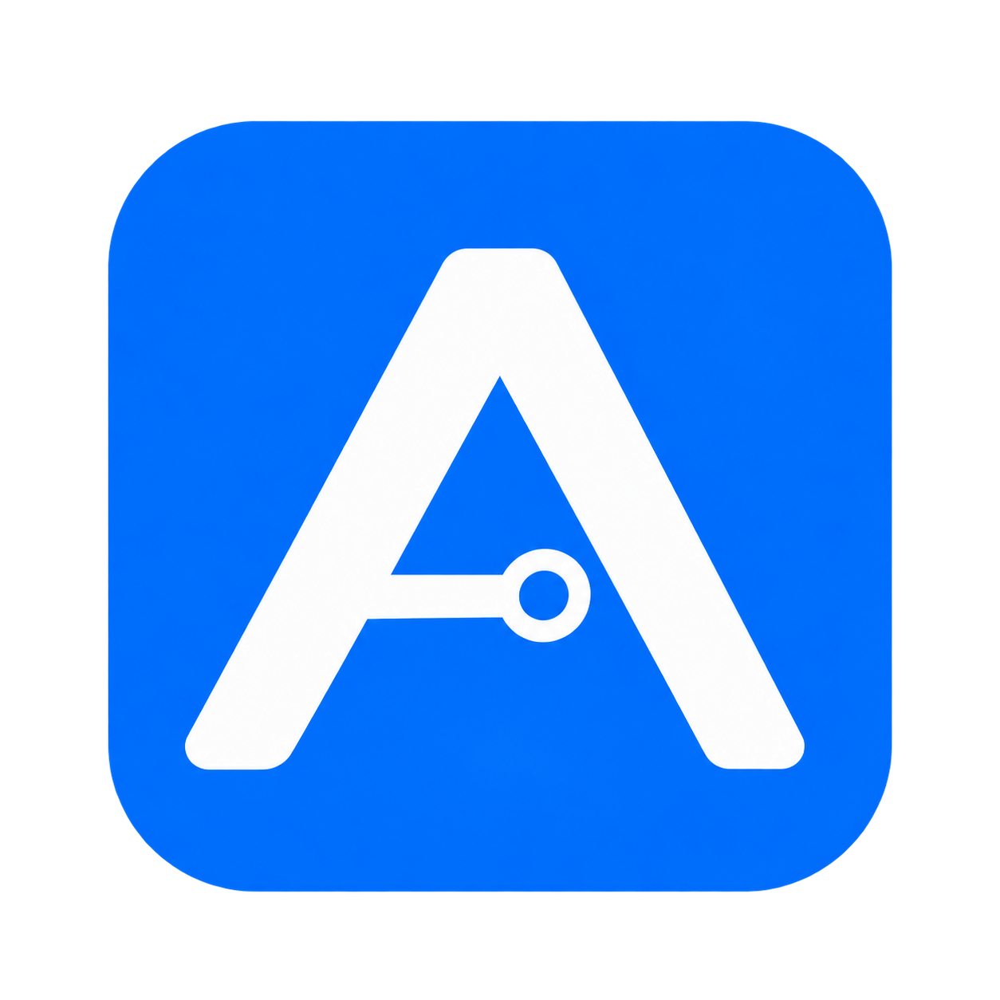
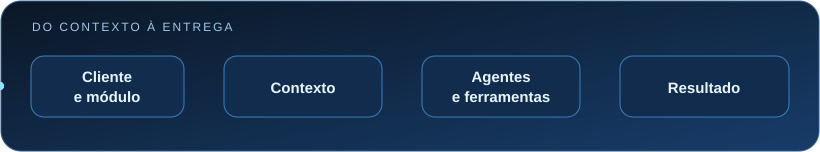

<div align="center">
  

  # Abapfy

  **Workspace desktop para equipes SAP: conhecimento, agentes de IA e trabalho por cliente em um só lugar.**

  [](CHANGELOG.md)
  [](https://github.com/esc4n0rx/abapfyv2/releases)
  [](package.json)
  [](package.json)

  [Baixar a versão mais recente](https://github.com/esc4n0rx/abapfyv2/releases/latest) · [Começar a desenvolver](#comece-em-poucos-minutos) · [Documentação do banco](supabase/README.md) · [Novidades](CHANGELOG.md)
</div>

<div align="center">
  
</div>

## O que é

O Abapfy reúne conversas com IA, agentes especializados em SAP/ABAP, documentos de referência e tarefas em um aplicativo desktop. O trabalho é organizado por **cliente → módulo → pastas, arquivos e sessões**. Cada sessão pode aproveitar o contexto do cliente, do projeto e da pasta selecionada, sem exigir que os mesmos arquivos sejam anexados novamente.

O aplicativo usa Supabase para autenticação e persistência, oferece provedores OpenAI, Gemini e Claude e integra ferramentas externas por Model Context Protocol (MCP). A interface segue o [sistema visual SAP Fiori Horizon](DESIGN.md).

## Recursos principais

| Área | O que você encontra |
| --- | --- |
| **Clientes e drive** | Clientes, módulos, subpastas, arquivos compartilhados, pré-visualização de PDF/DOCX, lixeira e indicação de atividade da equipe. |
| **Conversas com IA** | Histórico persistente, respostas em streaming, anexos, seleção de modelo, agentes e skills, perguntas de esclarecimento e respostas estruturadas. |
| **Contexto SAP** | Produto/release SAP por sessão, base de conhecimento do projeto, arquivos da pasta e referências recuperadas para apoiar as respostas. |
| **Agentes e skills** | Catálogo de agentes SAP, importação de agentes e skills em Markdown, seleção automática de especialidade e skills relevantes. |
| **MCP** | Servidores HTTP e `stdio`, vínculo com agentes, uso de ferramentas e recursos, cancelamento e confirmação no aplicativo para ações sensíveis. |
| **Projetos e tarefas** | Projetos com contexto próprio; quadro de tarefas com colunas configuráveis, subtarefas, prioridade, responsável e estimativas. |
| **Documentos e métricas** | Geração de especificação funcional em `.docx` a partir do modelo incluído; estatísticas de uso pessoal. |
| **Administração** | Papéis MASTER e ADMIN, convites e provisionamento de chaves de IA e integrações conforme as políticas do banco. |

> A disponibilidade de recursos colaborativos e administrativos depende das migrações correspondentes no projeto Supabase. O aplicativo não as aplica automaticamente.

## Tecnologias

| Camada | Tecnologias |
| --- | --- |
| Desktop e build | Electron 32, electron-vite, electron-builder |
| Interface | React 18, TypeScript, React Router, Zustand, tokens SAP Fiori Horizon |
| Dados e autenticação | Supabase Auth, PostgreSQL, Row Level Security (RLS), Storage |
| IA e integrações | OpenAI, Gemini, Claude, SDK Model Context Protocol |
| Documentos | pdfjs-dist, mammoth, pizzip, Markdown e realce de código |

## Comece em poucos minutos

### Usar o aplicativo

1. Baixe o instalador da sua plataforma na [página de releases](https://github.com/esc4n0rx/abapfyv2/releases/latest): instalador Windows (`.exe`), imagem macOS (`.dmg`) ou pacote Linux (`.AppImage`).
2. Instale e entre com sua conta. O acesso da equipe e as integrações de IA são configurados por MASTER/ADMIN no ambiente conectado.
3. Abra **Clientes**, escolha o cliente e o módulo, crie ou abra uma sessão e selecione a pasta de referência quando necessário.
4. Escolha um modelo disponível, descreva a tarefa e confira as fontes, ferramentas e confirmações apresentadas durante a execução.

Para recuperar a senha por código, o ambiente precisa ter o [SMTP e o template de e-mail configurados](supabase/email-templates/README.md).

### Desenvolver localmente

**Pré-requisitos:** Node.js 20, pnpm 9 e acesso a um projeto Supabase configurado. O repositório contém o aplicativo Electron; [`external/`](external/README.md) é um dashboard administrativo web separado, com instalação própria.

```bash
git clone https://github.com/esc4n0rx/abapfyv2.git
cd abapfyv2
pnpm install --frozen-lockfile
```

Copie `.env.example` para `.env` e preencha as credenciais **públicas** do projeto Supabase:

```dotenv
VITE_SUPABASE_URL=https://seu-projeto.supabase.co
VITE_SUPABASE_ANON_KEY=sua-chave-anon
```

Em seguida, aplique os scripts de [`supabase/README.md`](supabase/README.md) **na ordem indicada**, incluindo os scripts de RLS e o seed de agentes. Use um projeto de desenvolvimento para validar alterações de banco. Os recursos de clientes, pastas, presença e administração dependem especialmente dos scripts `021` a `025`; confira o que já foi aplicado antes de executar qualquer migração.

```bash
pnpm dev
```

O `pnpm build` valida a presença das duas variáveis `VITE_*` antes de compilar. Nunca coloque uma `service_role` ou segredo privado em variáveis `VITE_*`: elas fazem parte do bundle do renderer.

Se a inicialização reclamar de `VITE_SUPABASE_URL` ou `VITE_SUPABASE_ANON_KEY`, confira o `.env` na raiz do repositório. Se login ou recursos de clientes falharem após o app abrir, confira as migrações, políticas RLS e configurações de Auth no Supabase antes de investigar o renderer.

## Como o projeto funciona

```text
src/
├── main/                 Electron: janela, IPC e clientes MCP
├── preload/              Ponte controlada entre main e renderer
└── renderer/src/
    ├── screens/          Chat, clientes, projetos, tarefas, agentes e skills
    ├── components/       Interface e configurações
    ├── store/            Estado do aplicativo com Zustand
    ├── lib/              Supabase, IA, contexto, anexos e utilitários
    ├── skills/           Catálogo de skills SAP incluídas no app
    └── styles/           Temas e tokens visuais
supabase/
├── sql/                  Esquema, funções, seeds e migrações numeradas
├── rls/                  Políticas de acesso aos dados
└── email-templates/      Modelo de recuperação de senha
resources/                Marca e recursos do aplicativo
build/                    Recursos do empacotamento
external/                 Dashboard administrativo web independente
test-e2e/                 Cenários manuais de ponta a ponta
```

O renderer gerencia a experiência de chat e consulta o Supabase. O processo principal do Electron hospeda as conexões MCP, enquanto o preload expõe apenas as operações necessárias ao renderer. Conversas, mensagens, projetos e preferências ficam no Supabase; o acesso é controlado por autenticação, papéis e políticas RLS. Consulte [os scripts SQL e a ordem de instalação](supabase/README.md) para o contrato de dados.

### Fluxo de uma sessão

1. Selecione cliente, módulo e, opcionalmente, projeto ou pasta do drive.
2. O aplicativo reúne o contexto disponível e escolhe o agente e as skills da sessão, quando o roteamento automático está habilitado.
3. O provedor de IA gera a resposta; ferramentas MCP vinculadas podem ser chamadas, com confirmação para operações sensíveis.
4. A resposta, as métricas e a atividade das ferramentas são registradas na conversa. Arquivos de referência continuam acessíveis para as próximas sessões da mesma pasta.

As respostas geradas por IA exigem revisão humana, sobretudo antes de aplicar mudanças em sistemas SAP ou usar documentos como entregáveis finais.

## Configuração e segurança

| Configuração | Onde fica | Observação |
| --- | --- | --- |
| URL e chave `anon` do Supabase | `.env` local / segredos de build | Necessárias para desenvolver e empacotar. Use `.env.example` como modelo. |
| Chaves dos provedores de IA | Configurações → Inteligência Artificial | A gravação e o provisionamento dependem das permissões MASTER/ADMIN da migração `025`. |
| Servidores MCP | Configurações → Inteligência Artificial | Configuração e vínculos com agentes; ações de escrita exigem confirmação no aplicativo. |
| Recuperação de senha | Painel do Supabase | Requer SMTP e o [template versionado](supabase/email-templates/README.md). |

As políticas de RLS estão em [`supabase/rls/`](supabase/rls/). A instalação das políticas e funções é responsabilidade de quem administra o projeto Supabase. Consulte também a [nota sobre armazenamento de chaves de IA](supabase/README.md#ordem-de-execução) antes de usar um ambiente de produção.

## Comandos úteis

| Comando | Finalidade |
| --- | --- |
| `pnpm dev` | Inicia o Electron em desenvolvimento. |
| `pnpm typecheck` | Verifica os tipos do main/preload e do renderer. |
| `pnpm lint` | Executa o ESLint. |
| `pnpm build` | Valida o ambiente e compila o aplicativo. |
| `pnpm start` | Abre a prévia da build local. |
| `pnpm build:win` | Compila e empacota o instalador Windows. |
| `pnpm build:mac` | Compila e empacota o DMG macOS. |
| `pnpm build:unpack` | Gera uma distribuição descompactada. |

Para testar fluxos SAP manualmente, use os exemplos de [`test-e2e/`](test-e2e/README.md).

## Distribuição e versões

O [workflow de release](.github/workflows/release.yml) é acionado por tags `v*.*.*`. Ele compila pacotes Windows, macOS e Linux e publica uma release do GitHub após validar os artefatos esperados. A compilação usa os segredos `VITE_SUPABASE_URL` e `VITE_SUPABASE_ANON_KEY`; publicar o aplicativo **não** executa scripts SQL no Supabase.

Consulte o [changelog](CHANGELOG.md) para o histórico de versões. A marca atual usada no aplicativo e nos pacotes está em [`resources/abapfy-horizon-mark.png`](resources/abapfy-horizon-mark.png).

## Documentação complementar

- [Design system e diretrizes de interface](DESIGN.md)
- [Banco de dados, RLS e ordem das migrações](supabase/README.md)
- [Recuperação de senha por e-mail](supabase/email-templates/README.md)
- [Dashboard administrativo web](external/README.md)
- [Cenários manuais de teste](test-e2e/README.md)
- [Histórico de versões](CHANGELOG.md)

## Contribuindo

Abra uma issue para discutir mudanças de produto ou contrato de dados. Para contribuir com código, crie uma branch, mantenha a alteração focada, atualize a documentação afetada e execute `pnpm typecheck` e `pnpm lint` antes de propor um pull request. Mudanças de interface devem seguir [`DESIGN.md`](DESIGN.md); mudanças no Supabase devem indicar claramente a ordem de aplicação e as políticas RLS correspondentes.
